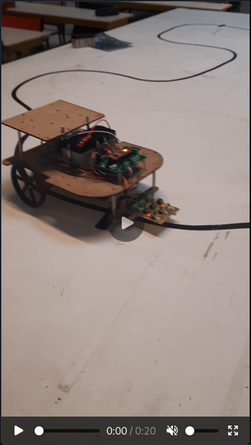
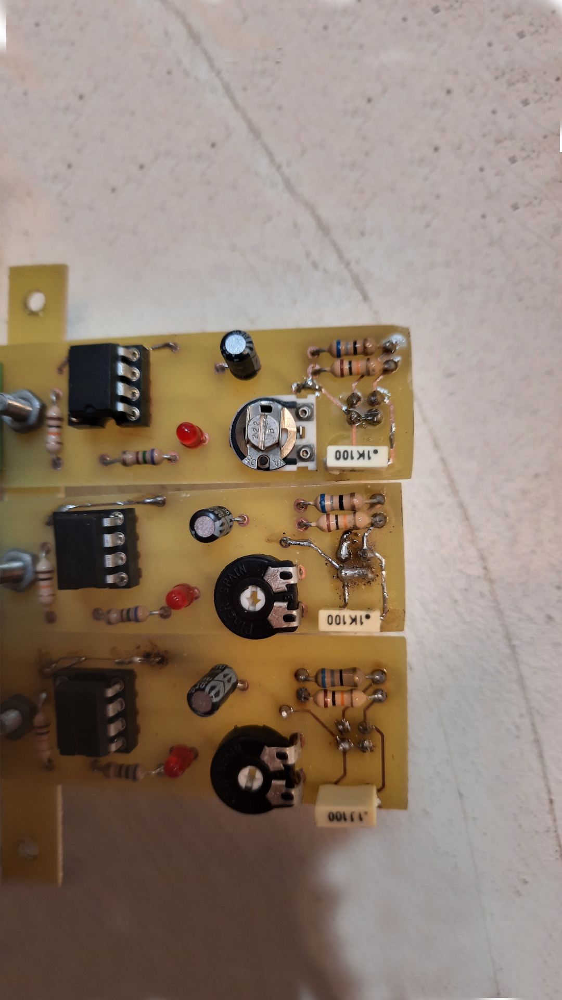
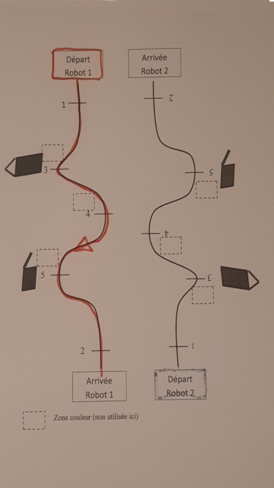
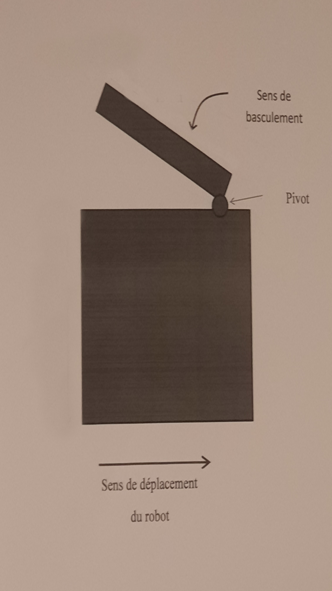

Robot suiveur de ligne réalisé dans le cadre de mes études en BUT GEII (Génie Électrique Informatique Industrielle) en Conception et Réalisation de Systèmes Embarqués.

# Composition du Robot

- 1 micro-contrôleur PIC16F18446 *(Curiosity Nano)*

- 3 capteurs de lignes noires

- 1 roue folle

- 2 roues motrices *(moteurs CC 12V)*

- 1 lanceur de balle *(moteur CC)*

- 1 pivot *(servo-moteur)*

# Objectifs

- Suivre une ligne **noire** sur fond blanc *(le plus rapidement possible)*

- détecter des lignes horizontales à celle-ci représentants des lignes d'arrêts *(au nombre de 5)*

- effectuer des actions attribuer à chacune de ces lignes d'arrêts

# Concours CRSE - IUT 1

Concours réunissant la promotion de $1^{\text{ere}}$ année de BUT GEII.

Tournoi en 1 vs 1.

## Qualifications

	- 2 matchs contre adversaires tirés au sort

	- 1 seul round par match

	- 8 robots ayant obtenu le plus de points qualifiés en phase finale

|  |  |
|---------|---------|
| Robot le plus rapide  |  **3 points** |
| But marqué  | **2 points**  |
| Pivot Basculé en dans le bon sens  | **2 points**  |

## Phases finales

	- arbre à simple élimination

	- 2 rounds par match

	- le plus rapide gagne le round

# Photos et Vidéo

| Suivi de ligne | cartes capteurs de lignes | 
| ----------------------------- | ------------------------------ |
|  |   |
| **Parcours à réaliser** | **Action n°2 *(Pivot)*** |
|  |   |